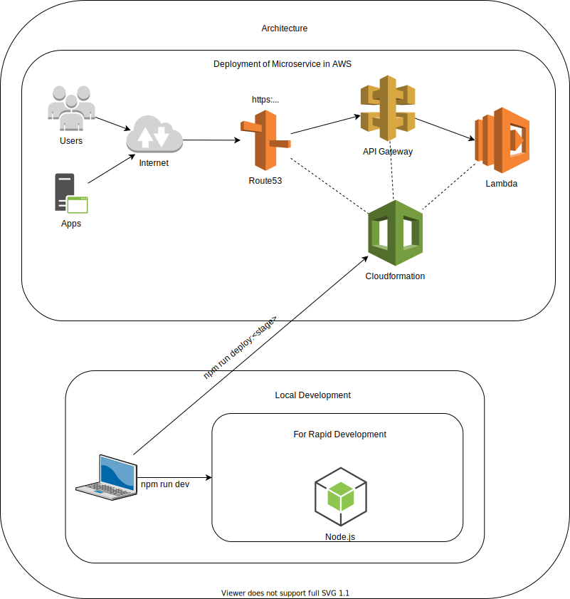

# Introduction 


• [Website](https://www.bcx.co.za/exa/)

## Introduction

---

As part of the BCX Exa open-source initiative, we would like to give back to the community.

This specific piece of code allows you to run a server-side website using Vue.js and Nuxt on AWS Lambda.

- Our demo site runs for under $1 a month. $0.58 to be exact.
- The domain is $12 per year.
- The initial deployment takes less than 1 hour.
- Subsequent deployments take less than 10 min.

> Warning: Pricing might vary depending on the amount of traffic hitting your website. See AWS Lambda & API Gateway pricing to understand what YOUR true cost would be.

---

## Main Components in Tech Stack

- Vue.js
- Nuxt
- Vuetify
- AWS Lambda
- AWS Api Gateway
- AWS Route 53
- Serverless Framework
- Github with CodeBuild & CodePipeline
- D3

---

# Quick Start

### Initial Setup

---

1. Install Node.js & AWS Cli

- https://docs.aws.amazon.com/cli/latest/userguide/install-cliv2-windows.html
- https://nodejs.org/en/

> Note: In some instances you need to restart your machine after installing these packages.

2.  Install Serverless and Cross-env globally

```bash
npm install -g serverless && npm install -g cross-env
```

3. Install all packages

```bash
npm install
```

4. Configure your AWS profile

```bash
aws configure --profile <YOUR_AWS_PROFILE_NAME>
```

> Note: At this stage, you should be able to run the service locally using the command below.

```bash
npm run dev
```

5. Create a domain using Route53, see link below on how to do this.

- https://docs.aws.amazon.com/Route53/latest/DeveloperGuide/domain-register.html

> Warning: On completion of this step, it will start costing you money.

After creating your domain, Route53 will create the Hosted Zone automatically. It generally takes about 15-30 min for this step to complete.

6. Configure your env variables inside your environments folder.

- .env.dev
- .env.uat
- .env.prod

```bash
APP_NAME=<YOUR APP NAME>
NODE_ENV=<YOUR NODE ENV>
STAGE=<YOUR STAGE>
HOSTED_ZONE_ID=<YOUR HOSTED ZONE ID>
DOMAIN=<YOUR DOMAIN NAME>
AWS_PROFILE=<YOUR AWS PROFILE NAME>
```

---

7. Finally, you can deploy the respective environments using the commands below.

### For Dev/UAT/Prod Deployments

---

```bash
npm run deploy:dev
npm run deploy:uat
npm run deploy:prod
```

### Deployment Notes

- Note: Lambda cold start plays a role in showing the initial load of your website. Consider running serverless-plugin-warmup in production to keep your response times low.
- Note: On initial deployment, the automated process to validation your certificate might take up to 40 min, To fast track the process, log into the aws console and create the CNAME in Route53 manually. The certificate will be created in N. Virgina inside Certificate Manager.

---

8. Adding CICD (Optional)

8.1 If you would like the respective environments to build and deploy automatically when you commit to the respective branch, assuming you are using Github, comment out the following lines in the serverless.yml file.

```bash
resources:
  - Resources:
  - ${file(iac/resources/iam.serverless.yml)}
  # - ${file(iac/cicd/codebuild.serverless.yml)}
  # - ${file(iac/cicd/codepipeline.serverless.yml)}
```

8.2 Create a file in the environments folder called .env.local and add the following to the file.

```
GITHUB_OWNER=<OWNER OF REPO NAME>
GITHUB_REPO=<YOUR REPO NAME>
GITHUB_TOKEN=<YOUR GITHUB TOKEN>
```

### Destroying environments Dev/UAT/Prod

---

```bash
npm run destroy:dev
npm run destroy:uat
npm run destroy:prod
```

> Warning: This will destroy everything that was created by serverless, this excludes the domain you created manually.

---

See the architecture below



# Version

- 0.0.1 Beta

# Contributions

- BCX Exa Team
- [Serverless Community](https://www.serverless.com/examples/aws-node-vue-nuxt-ssr)
